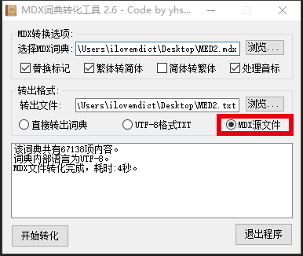
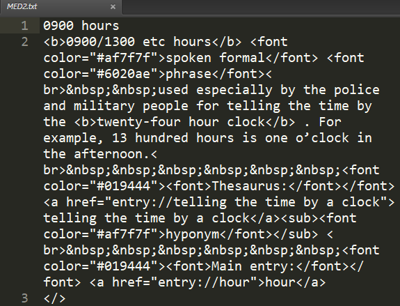

# customiseMdxFromList

## COCA5000.txt
`COCA5000.txt` 储存了 `https://www.wordfrequency.info/free.asp?s=y` 页面上的 COCA5000 词汇表，每个单词一行

## COCA5000_list.py
`COCA5000_list.py` 将上面的 txt 文件转换为 Python 中的列表数据格式，并将其赋值给 wordList 变量，该 .py 文件可作为模块导入其他 Python 程序。这个文件是由 `line2list.py` 生成的。

## line2list.py
输入：文件名.txt  
输出：文件名_list.txt  
功能：将每行的内容转换为 Python 中的列表数据格式，并将其赋值给 wordList 变量。

## customiseMdxFromList.py
首先将所需词库的 .mdx 文件在 GetDict.exe 中转换为 `MDX 源文件`，如下图所示：  

生成的 .txt 类型的`MDX 源文件`，应该是一行词头，一行释义，一行 `</>`，如下图所示：  

接下来，就可以使用 customiseMdxFromList.py 了！  
输入：刚刚生成的 .txt 文件（文件名.txt）  
输出：文件名_customised.txt  
功能，仅保留 COCA5000_list.py 中 wordList 中的单词。如需修改单词列表，请使用 line2list.pt 生成列表并改变 customiseMdxFromList.py 中导入的 COCA5000_list 模块  
性能：约 2.5 秒/词，5000 词合共约 3.5 小时

最后，使用 MdxBuilder.exe 将 `文件名_customised.txt` 打包为 .mdx 文件，用于 MDict 等词典软件

## customiseMdxFromList.exe
由 customiseMdxFromList.py 封装。不用搭建 Python 环境，且程序里面集成了 COCA5000 的单词表，直接在 Windows 上就能使用。
